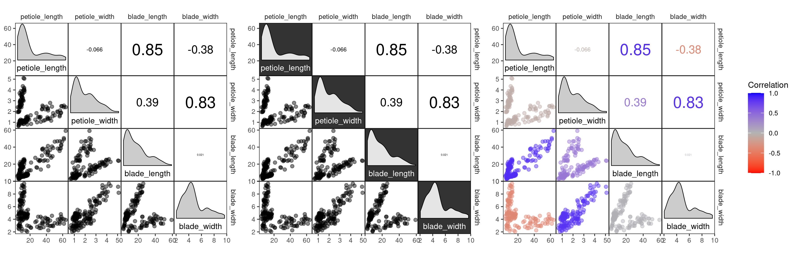
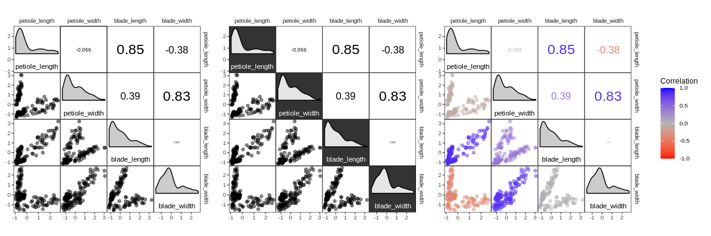
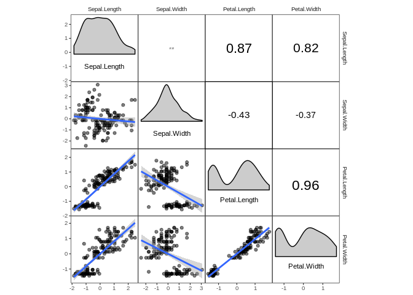
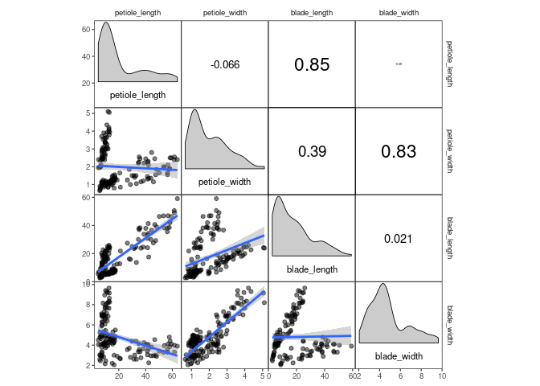
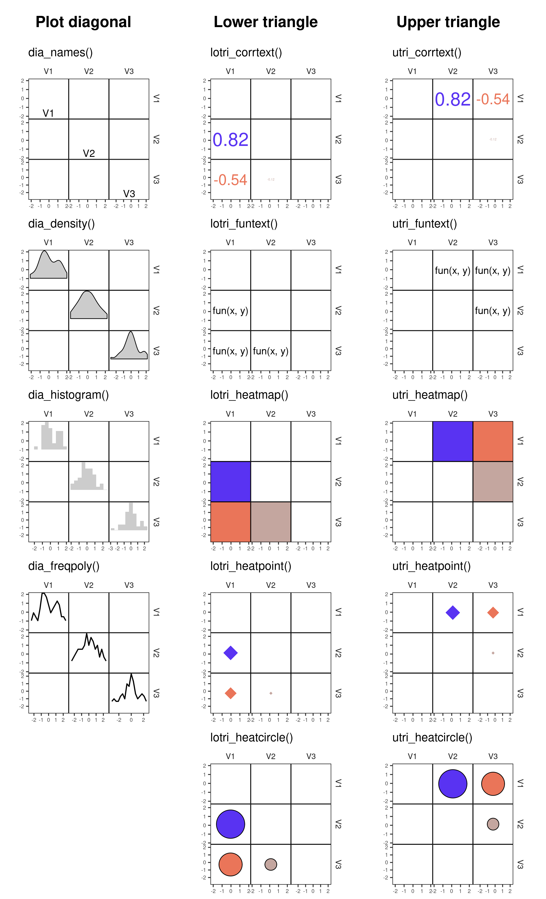
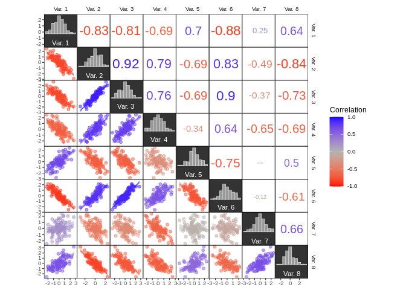
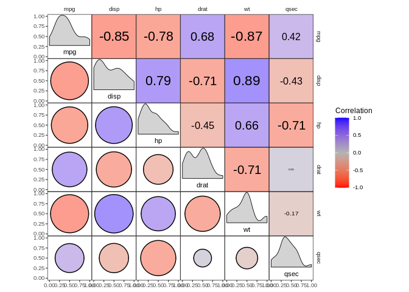
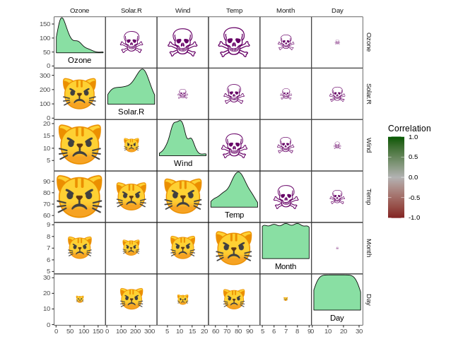
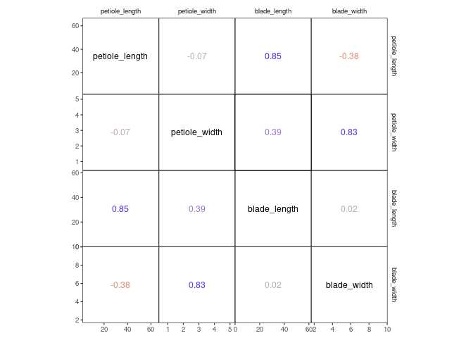

corrmorant: Flexible Correlation Matrices Based on ggplot2
================
Roman M. Link


## Description

`corrmorant` extends `ggplot2` by an automated framework for plots of
correlation matrices that can be easily modified via regular `ggplot2`
syntax. In addition, it provides a large set of visualization tools for
exploratory data analysis based on correlation matrices.

| Please note that this project is a work in progress\!                                                                                                                                                                                                                                                                                                         |
| ------------------------------------------------------------------------------------------------------------------------------------------------------------------------------------------------------------------------------------------------------------------------------------------------------------------------------------------------------------- |
| This package is in steady development. Whenever I have time, I add or change some features. A somewhat stable version should not be too far away - look out for announcements over here. I will then begin with a regular versioning process. Until the package reaches this stage, please note that features may change or disappear without further notice. |

**Update 2020-07-07:** As of today, the `corrmorant` package will
replace all uses of the `iris` dataset with the `drosera` dataset, which
contains a set of (eugenics-free) biometric measurements of three
African sundew species and is [available as a separate
data-package](https://github.com/r-link/drosera).

**Update 2020-04-28:** So far, the package seems to work fine with R. v.
4.0.0. Keep me informed if you notice any unwanted behavior.

**Update 2020-03-06:** The package passes all tests with the newest
`ggplot2`version (v. 3.3.0), but I haven’t been able to check more
thoroughly. I you notice any strange behavior with the new version,
please let me know\!

A big thank you goes out to the developers of the software without which
this package would not be possible, especially [Hadley
Wickham](https://github.com/hadley/) and the rest of the
[ggplot2](https://github.com/tidyverse/ggplot2) development team for
their incredible work.

## Installation

The package can be installed from Github using
`remotes::install_github()`:

``` r
# install remotes package if necessary
install.packages("remotes")
# install corrmorant from the github repository
remotes::install_github("r-link/corrmorant")
```

Afterwards, the package can be loaded regularly via `library()`:

``` r
library(corrmorant)
```

## Simple plots with corrmorant()

The `corrmorant()` function is a simple wrapper function around the more
complex `gcorrm()` function that can be used to create first, simple
plots of correlation matrices for initial data inspection. Currently,
three different styles are available, “light”, “dark” and the default,
“blue\_red”:

``` r
# correlation plot of the drosera data using style = 'light'
corrmorant(drosera, style = "light")
# the "dark" style has a dark background in the diagonal facets
corrmorant(drosera, style = "dark")
# in the "blue_red" style, colors and correlation labels are colored by the strength of
# correlation
corrmorant(drosera, style = "blue_red")
```



It obvious that this illustration is not optimal because the three
different *Drosera* species have remarkably different leaf morphologies.
More complex plots (e.g. with different correlations for different
groups) are possible with `ggcorrm()`.

## Basic usage of ggcorrm()

While `corrmorant()` may be useful for many basic data inspection tasks,
its functionality is rather limited. If you want to take control of the
elements in a plot, you can use `ggcorrm()` together with the corrmorant
selector functions `lotri()`, `utri()` and `dia()` that direct ggplot
layers to the lower or upper triangle or the plot diagonal of a
`ggcorrm()` plot, respectively. In addition, corrmorant offers a series
of utility functions for readymade data summaries on the plot diagonal
(`dia_names()`, `dia_density()`, `dia_histogram` and `dia_freqpoly()`)
as well as a couple of new stats, e.g. `stat_corrtext()` for displaying
correlation strength in correlation plot facets. The new `corrmorant`
stats can generally be called in a simplified form by prefixing their
name with `lotri_` or `utri_`, e.g. `lotri_corrtext()` and
`utri_corrtext()`

For example, `corrmorant(drosera, style = "light")` can be recreated by
the following code:

``` r
p1 <- ggcorrm(drosera) +
  lotri(geom_point(alpha = 0.5)) +
  utri_corrtext() +
  dia_names(y_pos = 0.15, size = 3) +
  dia_density(lower = 0.3, fill = "grey80", color = 1)
p1
```

<!-- -->

If you want, you can add additional ggplot2 layers, using the
appropriate corrmorant selectors to restrict them to the appropriate set
of facets. For example, you might want to display a linear trend in the
facets on the lower triangle:

``` r
p1 + lotri(geom_smooth(method = "lm"))
```

    ## `geom_smooth()` using formula 'y ~ x'

<!-- -->

The horrific fit of these linear regressions results from the fact that
the `drosera` dataset contains data from three different sundew species.
You might want to include this information into your plot by plotting
the three species in different colours, which can easily be achieved by
setting plot level aesthetics using the `mapping` argument of
`ggcorrm()`:

``` r
ggcorrm(drosera, mapping = aes(col = species, fill = species)) +
  lotri(geom_smooth(method = "lm")) +
  lotri(geom_point(alpha = 0.5)) +
  utri_corrtext(nrow = 2, squeeze = 0.6) +
  dia_names(y_pos = 0.15, size = 3) +
  dia_density(lower = 0.3, color = 1)
```

<!-- -->

## Special corrmorant stats and geoms

| Panels       | Name                                     | Description                                                     |
| :----------- | :--------------------------------------- | :-------------------------------------------------------------- |
| Diagonal     | `dia_names()`                            | display text labels for variable names on the plot diagonal     |
|              | `dia_density()`                          | display density plots in diagonal panels                        |
|              | `dia_histogram()`                        | display histograms in diagonal panels                           |
|              | `dia_freqpoly()`                         | display frequency polygons in diagonal panels                   |
| Off-diagonal | `lotri_corrtext()` `utri_corrtext()`     | place text labels indicating correlation strength               |
|              | `lotri_funtext()` `utri_funtext()`       | create text labels with the output of user-definedfunctions     |
|              | `lotri_heatmap()` `utri_heatmap()`       | add correlation heatmap                                         |
|              | `lotri_heatpoint()` `utri_heatpoint()`   | add symbols whose size and color indicates correlation strength |
|              | `lotri_heatcircle()` `utri_heatcircle()` | add circles whose area scales with correlation strength         |



## Coloring data by correlation strength

To color a dataset by correlation strength, you can use the `.corr`
column internally created in `tidy_corrm()` together with
`scale_colour_corr()` or `scale_fill_corr()`:

``` r
# simulate some data from a multivariate normal distribution
# (mtcars is only used as a shortcut to a positive definite covariance matrix)
data1 <- MASS::mvrnorm(100, colMeans(mtcars),  cov(mtcars))[, 1:8]
colnames(data1) <- paste("Var.", 1:ncol(data1))

# create plot
ggcorrm(data1, 
        mapping = aes(col = .corr, fill = .corr),
        bg_dia = "grey20", 
        rescale = "by_sd") +
  lotri(geom_smooth(method = "lm", size = .3)) +
  lotri(geom_point(alpha = 0.5)) +
  utri_corrtext(nrow = 2, squeeze = 0.6) +
  dia_names(y_pos = 0.15, size = 3, color = "white") +
  dia_histogram(lower = 0.3, color = "grey80", fill = "grey60", size = .3) +
  scale_color_corr(aesthetics = c("fill", "color"))
```

    ## `geom_smooth()` using formula 'y ~ x'

<!-- -->

## Correlation heatmaps and more

`corrmorant` offers a series of new geoms and stats that are designed to
improve the display of correlation strength.

For example, there is a set of stats for correlation heatmaps and the
likes, which can be useful when inspecting datasets with large numbers
of variables:

``` r
select(mtcars, mpg, disp:qsec) %>% 
ggcorrm(rescale = "by_sd") +
  utri_heatmap(alpha = 0.5) +
  lotri_heatcircle(alpha = 0.5, col = 1) +
  utri_corrtext() +
  dia_names(y_pos = 0.15, size = 3) +
  dia_density(lower = 0.3, fill = "lightgrey", color = 1) +
  scale_fill_corr() 
```

<!-- -->

With `lotri_/utri_heatpoint()`, you can scale the diameter of any
character you want by correlation strength. And yes, you’re right, this
means you can display correlation strength by the size of purple skulls
and angry cat faces (at least if your graphical device allows Unicode
characters, which might or might not work on Windows):

``` r
airquality %>% 
ggcorrm() +
  lotri_heatpoint(pch = "\U1F63E") +
  utri_heatpoint(pch = "\U2620", col = "#660066") +
  dia_names(y_pos = 0.15, size = 3) +
  dia_density(lower = 0.3, fill = "#89DFA3", color = 1) +
  scale_size(range = c(1, 15)) + 
  scale_color_corr(option = "C")
```

    ## Some variables are highly skewed (abs(skew) > 1).
    ## Consider transformation for better display.

<!-- -->

## Print output of arbitrary functions of the data

If you want to place text labels for the output of arbitrary functions
in your plots, you can use `lotri/utri_funtext()`, which uses the same
placement rules as `stat_corrtext()`.

For instance, you could add labels for the slope of the linear models in
the lower triangle (note how y and x are swapped to account for the
reverse axes in the upper triangle).

``` r
# function to compute linear model slopes
lmslope <- function(x, y)  round(coef(lm(x ~ y))[2], 2)

# add slopes using a function
ggcorrm(drosera, mapping = aes(col = species, fill = species)) +
  lotri(geom_point(alpha = 0.4)) +
  lotri(geom_smooth(alpha = 0.4, method = "lm")) +
  utri_funtext(fun = lmslope, squeeze = 0.6) +
  dia_density(lower = 0.3, col = 1, alpha = 0.4) +
  dia_names(y_pos = 0.15)
```

<!-- -->

Besides using a two-parameter formula, `stat_funtext()`, the stat
underlying `lotri/utri_funtext()`, also accepts rlang style lambda
expressions describing functions and quosures generated with `quo()`
(referring to the variable names `x` and `y`).

Here are two ways to copy the output of `stat_corrtext()` - using a
lambda expression (a formula containing `.x` and `.y`) in the upper and
a quosure in the lower triangle:

``` r
ggcorrm(drosera, aes(col = .corr), rescale = "as_is") +
  utri_funtext(fun = ~ round(cor(.x, .y), 2)) +
  lotri_funtext(fun = quo(round(cor(x, y), 2))) +
  dia_names(y_pos = 0.5) +
  scale_color_corr()
```

<!-- -->
