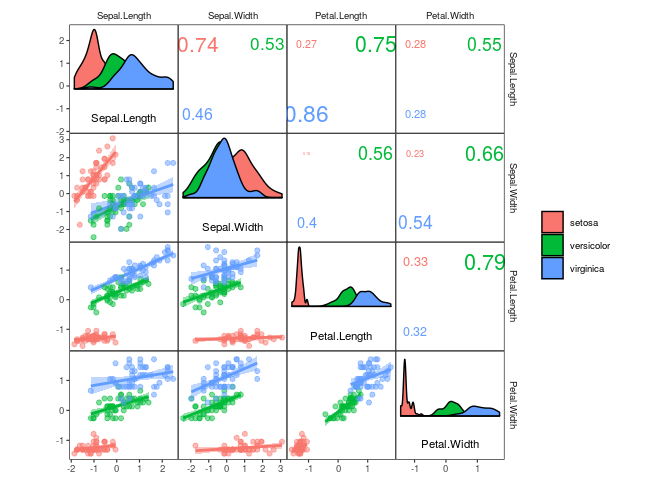
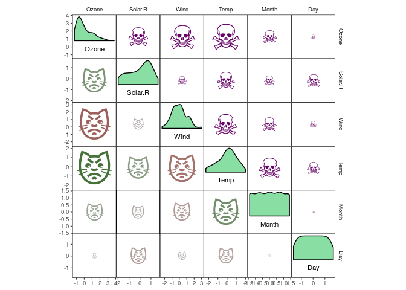

corrmorant: Flexible Correlation Matrices Based on ggplot2
================
Roman M. Link

Description
-----------

`corrmorant` extends `ggplot2` by an automated framework for plots of correlation matrices that can be easily modified via regular `ggplot2` syntax. In addition, it provides a large set of visualization tools for exploratory data analysis based on correlation matrices.

<table>
<colgroup>
<col width="100%" />
</colgroup>
<thead>
<tr class="header">
<th>Please note that this project is a work in progress!</th>
</tr>
</thead>
<tbody>
<tr class="odd">
<td>I have just begun moving the project to this repository and converting it to a regular R package architecture, so expect lots of changes in the next weeks until I finish a workable version.</td>
</tr>
</tbody>
</table>

Motivation
----------

The inspection of correlation matrices is a central part of exploratory data analysis. As collinearity between predictors has the potential to seriously compromise the quality of regression results - as well as hinder a straightforward interpretation of regression coefficients - the inspection of the correlations among potential predictor variables as well as the desired response should precede fitting any regression model with more than one predictor. In addition, with structural equation models (and their cousins, confirmatory factor analysis and path analysis), there is an entire class of models that traditionally is estimated directly from the covariance matrix of a multivariate dataset.

Long story short - there are plenty of reasons why one might want to visually inspect the interrelationships between all variables in a dataset simultaneously. However, while R provides plenty of functions and packages to display correlations, so far (at least to my knowledge) all of them are only able to display certain types of correlation plots, and none of them truly leverages the full flexibility of `ggplot2`.

`corrmorant` is meant to give you this flexibility. It is designed to blend in seamlessly in a data analysis framework based on the `tidyverse`. It offers a broad variety of functions that allow you to create a large number of different correlation plots, and can be extended easily with new geoms, stats and themes, just as `ggplot2` itself.

In case you wonder about the name: One day when I was riding my bike to work and thinking about stupid puns related to **corr**elation **m**atrices, a shiny black bird appeared. In this very moment I knew that I'd have to take the loose collection of ideas concerning correlation plots that was haunting me for a while and convert it into a real package...

Installation
------------

The package can be installed from Github using `devtools::install_github()`:

``` r
# install devtools package if necessary
install.packages("devtools")
# install corrmorant from the github repository
devtools::install_github("r-link/corrmorant")
```

Afterwards, the package can be loaded regularly via `library()`:

``` r
library(corrmorant)
```

    ## Loading required package: ggplot2

    ## Loading required package: rlang

Simple plots with corrmorant()
------------------------------

The `corrmorant()` function is a simple wrapper function around the more complex `gcorrm()` function that can be used to create first, simple plots of correlation matrices. Currently, three different styles are available, "light", "dark" and "blue\_red":

``` r
# correlation plot of the iris data using style = 'light'
corrmorant(iris, style = "light")
```


``` r
# the "dark" style has a dark background in the diagonal facets
corrmorant(iris, style = "dark")
```


``` r
# in the "blue_red" style, colors and correlation labels are colored by the strength of
# correlation
corrmorant(iris, style = "blue_red")
```


Basic usage of ggcorrm()
------------------------

While `corrmorant()` may be useful for many basic data inspection tasks, its functionality is rather limited. If you want to take control of the elements in a plot, you can use `ggcorrm()` together with the corrmorant selector functions `lotri()`, `utri()` and `dia()` that direct ggplot layers to the lower or upper triangle or the plot diagonal of a `ggcorrm()` plot, respectively. In addition, corrmorant offers a series of utility functions for readymade data summaries on the plot diagonal (`dia_names()`, `dia_density()`, `dia_histogram` and `dia_freqpoly()`) as well as a couple of new stats, e.g. `stat_corrtext()` for displaying correlation strength in correlation plot facets. The new `corrmorant` stats can generally be called in a simplified form by prefixing their name with `lotri_` or `utri_`, e.g. `lotri_corrtext()` and `utri_corrtext()`

For example, `corrmorant(iris, style = "light")` can be recreated by the following code:

``` r
p1 <- ggcorrm(iris) +
  lotri(geom_point(alpha = 0.5)) +
  utri_corrtext() +
  dia_names(y_pos = 0.1, size = 3) +
  dia_density(lower = 0.4, fill = "grey80", color = 1)
p1
```


If you want, you can add additional ggplot2 layers, using the appropriate corrmorant selectors to restrict them to the appropriate set of facets. For example, you might want to display a linear trend in the facets on the lower triangle:

``` r
p1 + lotri(geom_smooth(method = "lm"))
```


The horrific fit of these linear regressions results from the fact that the iris dataset consists of data from three different species. You might want to include this information into your plot by plotting the three species in different colours, which can easily be achieved by setting plot level aesthetics using the `mapping` argument of `ggcorrm()`:

``` r
ggcorrm(iris, mapping = aes(col = Species, fill = Species)) +
  lotri(geom_smooth(method = "lm")) +
  lotri(geom_point(alpha = 0.5)) +
  utri_corrtext(nrow = 2) +
  dia_names(y_pos = 0.1, size = 3) +
  dia_density(lower = 0.4, color = 1)
```


Correlation heatmaps and more
-----------------------------

`corrmorant` offers a series of new geoms and stats that are designed to improve the display of correlation strength.

For example, there is a set of stats for correlation heatmaps and the likes, which can be very useful when inspecting datasets with large numbers of variables:

``` r
select(mtcars, mpg, disp:qsec) %>% 
ggcorrm() +
  utri_heatmap(alpha = 0.5) +
  lotri_heatcircle(alpha = 0.5, col = 1) +
  utri_corrtext() +
  dia_names(y_pos = 0.1, size = 3) +
  dia_density(lower = 0.4, fill = "lightgrey", color = 1) +
  scale_fill_corr() 
```



With `lotri_/utri_heatpoint()`, you can scale the diameter of any character you want by correlation strength. And yes, your right, this means you can display correlation strength with purple skulls and angry cat faces:

``` r
airquality %>% 
ggcorrm(aes(col = .corr)) +
  lotri_heatpoint(pch = "\U1F63E") +
  utri_heatpoint(pch = "\U2620", col = "#660066") +
  dia_names(y_pos = 0.1, size = 3) +
  dia_density(lower = 0.4, fill = "#89DFA3", color = 1) +
  scale_size(range = c(1, 15)) + 
  scale_color_corr(option = "C")
```


