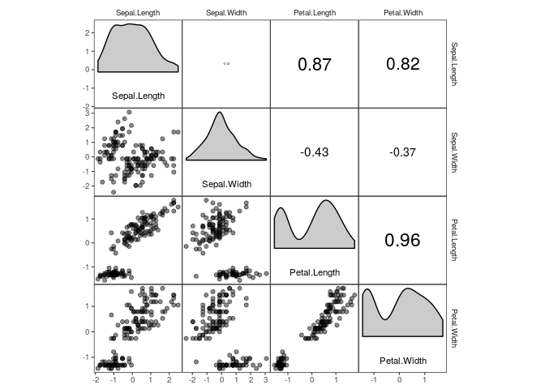
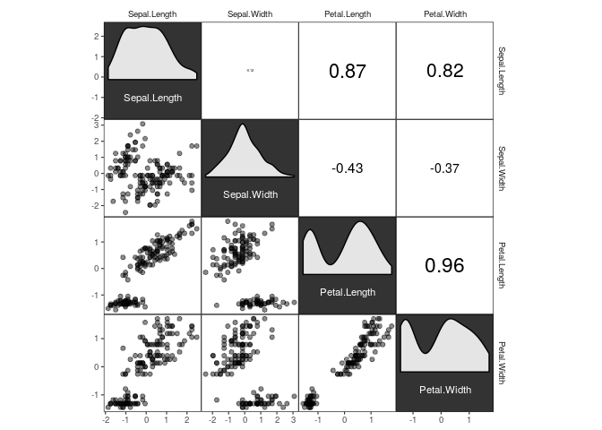
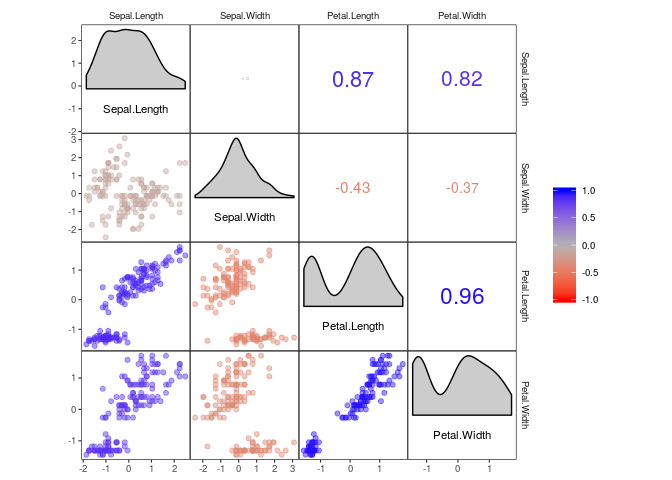
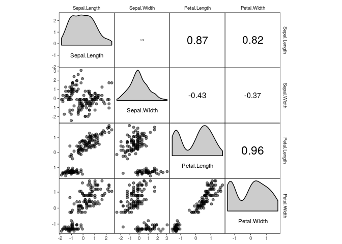
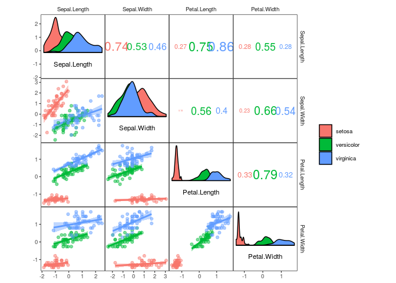

corrmorant: Flexible Correlation Matrices Based on ggplot2
================
Roman M. Link

Description
-----------

`corrmorant` extends `ggplot2` by an automated framework for plots of correlation matrices that can be easily modified via regular `ggplot2` syntax. In addition, it provides a large set of visualization tools for exploratory data analysis based on correlation matrices.

<table>
<colgroup>
<col width="100%" />
</colgroup>
<thead>
<tr class="header">
<th>Please note that this project is a work in progress!</th>
</tr>
</thead>
<tbody>
<tr class="odd">
<td>I have just begun moving the project to this repository and converting it to a regular R package architecture, so expect lots of changes in the next weeks until I finish a workable version.</td>
</tr>
</tbody>
</table>

Installation
------------

The package can be installed from Github using `devtools::install_github()`:

``` r
# install devtools package if necessary
install.packages(devtools)
# install corrmorant from the github repository
devtools::install_github("r-link/corrmorant")
```

Afterwards, the package can be loaded regularly via `library()`:

``` r
library(corrmorant)
```

    ## Loading required package: ggplot2

    ## Loading required package: rlang

Simple plots with corrmorant()
------------------------------

The `corrmorant()` function is a simple wrapper function around the more complex `gcorrm()` function that can be used to create first, simple plots of correlation matrices. Currently, three different styles are available, "light", "dark" and "blue\_red":

``` r
# correlation plot of the iris data using style = 'light'
corrmorant(iris, style = "light")
```



``` r
# the "dark" style has a dark background in the diagonal facets
corrmorant(iris, style = "dark")
```



``` r
# in the "blue_red" style, colors and correlation labels are colored by the strength of
# correlation
corrmorant(iris, style = "blue_red")
```



Basic usage of ggcorrm()
------------------------

While `corrmorant()` may be useful for many basic data inspection tasks, its functionality is rather limited. If you want to take control of the elements in a plot, you can use `ggcorrm()` together with the corrmorant selector functions `lotri()`, `utri()` and `dia()` that direct ggplot layers to the lower or upper triangle or the plot diagonal of a `ggcorrm()` plot, respectively. In addition, corrmorant offers a series of utility functions for readymade data summaries on the plot diagonal (`dia_names()`, `dia_density()`, `dia_histogram` and `dia_freqpoly()`) as well as a new geom meant for displaying correlation strength in correlation plot facets (`geom_corrtext()`).

For example, `corrmorant(iris, style = "light")` can be recreated by the following code:

``` r
p1 <- ggcorrm(iris) +
  lotri(geom_point(alpha = 0.5)) +
  utri(geom_corrtext()) +
  dia_names(y_pos = 0.1, size = 3) +
  dia_density(lower = 0.4, fill = "grey80", color = 1)
p1
```



If you want, you can add additional ggplot2 layers, using the appropriate corrmorant selectors to restrict them to the appropriate set of facets. For example, you might want to display a linear trend in the facets on the lower triangle:

``` r
p1 + lotri(geom_smooth(method = "lm"))
```


The horrific fit of these linear regressions results from the fact that the iris dataset consists of data from three different species. You might want to include this information into your plot by plotting the three species in different colours, which can easily be achieved by setting plot level aesthetics using the `mapping` argument of `ggcorrm()`:

``` r
ggcorrm(iris, mapping = aes(col = Species, fill = Species)) +
  lotri(geom_smooth(method = "lm")) +
  lotri(geom_point(alpha = 0.5)) +
  utri(geom_corrtext(nrow = 2)) +
  dia_names(y_pos = 0.1, size = 3) +
  dia_density(lower = 0.4, color = 1)
```



...to be continued...
