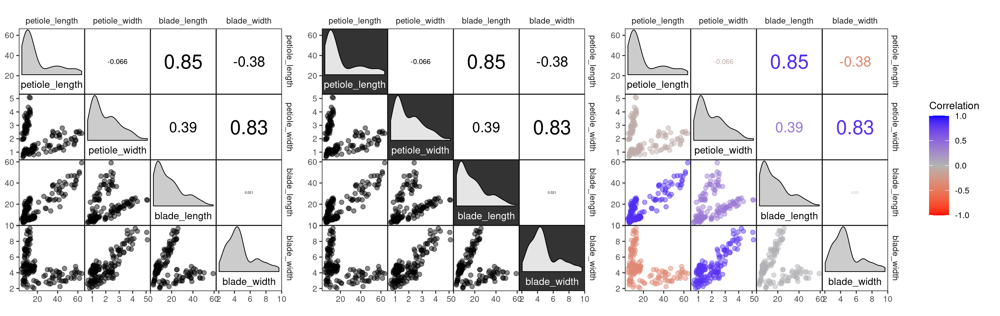
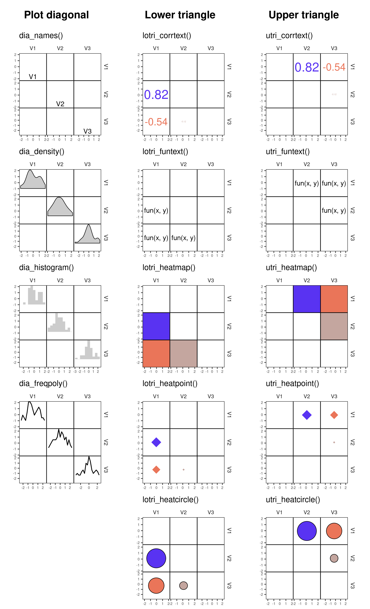

```{r, include = FALSE}
knitr::opts_chunk$set(
  collapse = TRUE,
  comment = "#>",
  fig.width = 6,
  fig.height = 6
)
```

```{r setup, include = FALSE}
library(corrmorant)
library(dplyr)
```


## Introduction
`corrmorant` is `ggplot2` extension that allows to create scatterplot matrices and correlation plots based on a slightly modified `ggplot2` syntax. The package both offers a simple standard function for creating scatterplot matrices with reasonable display settings using a minimum number of arguments (`corrmorant()`) and the possibility to create plots layer by layer using any kind of user-specified geoms based on `ggcorrm()`. Moreover, the package offers a large number of geoms and stats that automate common tasks in the display of scatterplot matrices. 

## Simple plots with corrmorant()
The `corrmorant()` function is a simple wrapper function around the more complex `gcorrm()` function that can be used to create first, simple plots of correlation matrices. Currently, four different styles are available - "blue_red" (the default), "light", "dark", and "binned", here illustrated based on the `drosera` dataset accompanying the package:

``` {r, eval=FALSE}
# correlation plot of the drosera data using style = 'light'
corrmorant(drosera, style = "light")
# the "dark" style has a dark background in the diagonal facets
corrmorant(drosera, style = "dark")
# in the "blue_red" style, colors and correlation labels are colored by the strength of
# correlation
corrmorant(drosera, style = "blue_red")
```



The "binned" style is a useful preset for very large datasets as it groups the data into bins (using a 10 by 10 grid in the standard settings) and plots them as points with a point size scaled by the number of observations, which speeds up plotting considerably. For this reason, the function is useful e.g. to inspect posterior correlations in MCMC draws.

``` {r}
# simulate large correlated dataset from a multivariate normal distribution
set.seed(111)                                        # set random seed
A     <- matrix(runif(6 * 6, -1, 1), nrow = 6)       # prepare 6*6 cov. matrix
large <- MASS::mvrnorm(10000, rep(0, 6), t(A) %*% A) # sample 10000 replicates
colnames(large) <- paste("Var.", 1:6)                # set column names

# plot with corrmorant() using the "binned" style setting
corrmorant(large, style = "binned")
```

The `corrmorant()` interface is kept simple on purpose as this function is mainly intended for fast visual checks of datasets. If you want to modify single elements of the plot, it is almost always preferable to use `ggcorrm()` instead.


## Basic usage of ggcorrm()
The `ggcorrm()` function allows to create plots of correlation matrices layer by layer using a slightly extended regular `ggplot()` syntax. If `ggcorrm()` is called on a matrix or data.frame, it automatically rearranges it into the format required for plotting, treating all numeric variables as columns/rows of the correlation matrix, and retaining all other data as additional columns of the plotting dataset that can be used for grouping. 

### Adding regular ggplot2 layers
You can add new layers and other `ggplot2` plot elements (e.g. scales, themes etc.) to a `ggcorrm()` object as if it was a regular `ggplot()` call. However, adding the same layers to all panels of a correlation matrix is rarely useful:

```{r}
ggcorrm(drosera) + geom_point(alpha = 0.5)
```

Usually, you will want to display different graphical elements in the plot diagonal, lower and upper triangular panels of the correlation matrix. This can be achieved with the three corrmorant selector functions `lotri()`, `utri()` and `dia()`, which can be used to modify ggplot layers (i.e. the output of calls to geoms, stats or the `layer()` function) and direct them only to the lower or upper triangle or the plot diagonal of a `ggcorrm()` plot, respectively. To use them, you simply have to wrap the ggplot layer into one of the selector functions:

```{r}
ggcorrm(drosera) + 
  lotri(geom_point(alpha = 0.5))
```

Internally, the selector functions modify the data passed to the layer to make sure only a subset for the desired panels is passed on. 

### New corrmorant geoms and stats
In addition to the default geoms and stats available in `ggplot2`, corrmorant introduces a series of new geoms and stats that simplify the creation of visually appealing correlation matrices. These can be grouped into a) data summaries and variable-specific information on the plot diagonal and b) data display and summaries in the off-diagonal panels. To simplify their usage, all corrmorant stats can be called directly by prefixing their name with `dia_`, `lotri_` or `utri_` instead of calling them via the corresponding selector functions. The prefixed versions differ from calls to the underlying stats by having a set of reasonable standard values and are preferable in most cases.

------------ -------------------- ---------------------------------------------
Panels       Name                 Description
------------ -------------------- ---------------------------------------------
Diagonal     `dia_names()`        display text labels for variable names on the  
                                  plot diagonal

             `dia_density()`      display density plots in diagonal panels

             `dia_histogram()`    display histograms in diagonal panels

             `dia_freqpoly()`     display frequency polygons in diagonal panels

Off-diagonal `lotri_corrtext()`   place text labels indicating correlation  
             `utri_corrtext()`    strength   
                       
             `lotri_funtext()`    create text labels with the output of         
             `utri_funtext()`     user-definedfunctions
             
             `lotri_heatmap()`    add correlation heatmap 
             `utri_heatmap()`      
                       
             `lotri_heatpoint()`  add symbols whose size and color indicates
             `utri_heatpoint()`   correlation strength
            
             `lotri_heatcircle()` add circles whose area scales with 
             `utri_heatcircle()`  correlation strength
------------ -------------------- ---------------------------------------------




Together with regular `ggplot2` geoms and stats, these new functions can be used as building blocks for more complex correlation matrix plots.

For example, `corrmorant(drosera, style = "light")` can be recreated by the following code:

```{r}
ggcorrm(drosera) +
  lotri(geom_point(alpha = 0.5)) +
  utri_corrtext() +
  dia_names(size = 3) +
  dia_density(fill = "grey80", color = 1)
```


## Working principle of ggcorrm()
### Data preparation
Under the hood, ggcorrm arranges the facets of the correlation matrix using `ggplot2::facet_grid()`. To be able to arrange a dataset across the facets, as a first step, `ggcorrm()` converts the data in a long-table format suitable for plotting. 

This is achieved by calling a `tidy_corrm` method, which automatically rearranges the columns in a suitable way and returns them in a tidy long form in a `tidy_corrm` object (a special type of tibble):

``` {r}
tidy_corrm(drosera)
```

As seen in the given example, there is a number of standard column names that describe the content of all numeric variables in the facets (`var_x:corr_group`), while all categorical variables are carried over with the dataset in their original form and can be used for grouping (in this case only `Species`). Additional columns can be created from these columns using the `mutates` argument (see below).


The content of the columns in a `tidy_corrm` object is as follows:

------------- -----------------------------------------------------------------
Column        Content
------------- -----------------------------------------------------------------
`var_x`       Name of the variable on the x-axis in the order of
              appearance in the raw data (ordered factor).

`var_y`       Name of the variable on the y-axis in the order of appearance
              in the raw data (ordered factor).

`x`           Data of the variable on the x axis (numeric).

`y`           Data of the variable on the y axis (numeric).

`type`        Type of panel (character, `"upper"`, `"lower"` or `"diag"`).

`.corr`       Correlation between x and y for the respective panel/group,
              `stats::cor()` using the method specified by
              `corr_method` and optionally within the groups specified with 
              `corr_group` (numeric).

`corr_group`  grouping variable for `.corr` (1 for all observations if
              no groups are specified).

Additional    All other columns specified in the dataset and/or 
columns       created via `mutates`.
------------- -----------------------------------------------------------------

It is also possible to call `ggcorrm()` directly on a `tidy_corrm` object. In this case, it will be directly plotted without reshaping of the data, and arguments that `ggcorrm()` passes to  `tidy_corrm()` are ignored. 

`tidy_corrm()` provides a set of options;
* labels
* correlation
* grouping
* mutates

